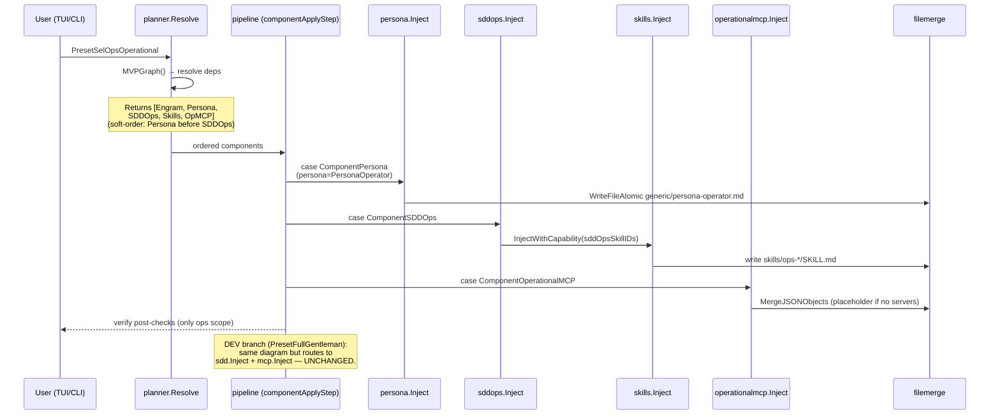

# Design: SelOps Operational Layer

## Overview

Additive operational profile bolted onto the existing installer engine. The DEV pipeline (`PersonaGentleman`/`ComponentSDD`/`ComponentSkills`/`ComponentContext7`) is untouched. A new `PresetSelOpsOperational` resolves to four new graph nodes — `PersonaOperator`, `ComponentSDDOps`, `ComponentSkills` (operator filter), and `ComponentOperationalMCP` — registered through the same 4-file recipe used by every existing component. Assets ship namespaced under `ops-*`/`selops-*` to keep upstream gentle-ai merges conflict-free. RAG and operational tools remain external MCP servers; the installer only writes connection entries.

## Architecture Decisions

### ADR-1 — Separate `internal/components/sddops/` package

**Choice**: New package `internal/components/sddops/` with its own `sddOpsSkillIDs` list and `sddops.Inject(...)` entry point.
**Alternatives rejected**: Extend `internal/components/sdd/` with a flag.
**Rationale**: `internal/components/sdd/inject.go` is the DEV-critical post-checks path (gentle-orchestrator, OpenCode multi-mode, profile orchestrators). Any conditional inside that function risks breaking DEV. A separate package guarantees zero collision with the upstream `sdd-orchestrator` machinery and lets sync evolve independently.

### ADR-2 — New `PresetSelOpsOperational` (not a Profile abuse)

**Choice**: Add a top-level `PresetID` constant.
**Alternatives rejected**: Reuse `model.Profile` (the cheap/premium model-routing struct).
**Rationale**: `Profile` switches MODELS within one persona; the DEV/OPS split switches the entire bundle (persona + skills + SDD-OPS + MCP). Reusing `Profile` would couple model routing to persona selection. Presets are how the planner already gates component bundles (`SkillsForPreset`); the new preset slots into the existing mechanism.

### ADR-3 — `internal/components/operationalmcp/` only writes connection entries

**Choice**: New package mirrors `mcp.Inject` shape, merges `mcpServers` entries via `filemerge.MergeJSONObjects`. NO retrieval, storage, or runtime logic.
**Alternatives rejected**: Embed a minimal RAG client; ship a default RAG server binary.
**Rationale**: The fork is a pure config installer (proposal §Scope Boundary, Engram decision `decision-rag-boundary`). RAG/email/drive/CRM are external MCP servers maintained outside this repo. Crossing that boundary turns the installer into a runtime.

### ADR-4 — Fork-private `ops-*` / `selops-*` namespace

**Choice**: Every new ID, asset path, and skill name is prefixed `ops-*` or `selops-*`.
**Alternatives rejected**: Reuse upstream names; introduce a "gentleman" variant.
**Rationale**: Upstream gentle-ai merges must remain conflict-free. Distinct prefixes guarantee structural separation in `mvpComponents`, `mvpSkills`, `personaContent` switch, and the asset tree (Engram decision `decision-sddops-scope`).

### ADR-5 — `go:embed` directive does NOT need to change

**Verified** at `internal/assets/assets.go:5`:
```go
//go:embed all:claude all:opencode all:generic all:skills all:gga all:gemini all:codex all:antigravity all:windsurf all:cursor all:kimi all:qwen all:kiro
```
`all:skills` is a recursive pattern — every subdirectory under `internal/assets/skills/` (including new `ops-*` dirs) is embedded automatically. New top-level dirs (e.g. a hypothetical `internal/assets/selops/`) WOULD require updating the directive. **Decision**: place operator persona assets under existing `generic/` (e.g. `generic/persona-operator.md`) and place SDD-OPS skill assets under `skills/ops-*/` — no go:embed edit needed.

## New Types & Signatures (illustrative)

### `internal/model/types.go`
```go
const PersonaOperator PersonaID = "operator"

const (
    ComponentSDDOps         ComponentID = "sddops"
    ComponentOperationalMCP ComponentID = "operationalmcp"
)

const PresetSelOpsOperational PresetID = "selops-operational"
```

### `internal/components/sddops/inject.go` (new package)
```go
package sddops

func Inject(targetDir string, adapter agents.Adapter, opts InjectOptions) (InjectionResult, error)

type InjectOptions struct {
    WorkspaceDir string
    Capability   string
}

var sddOpsSkillIDs = []model.SkillID{
    "ops-standard-documentation",
    "ops-modular-architecture",
    "ops-data-contracts",
    "ops-governance",
    "ops-observability",
    "ops-graduated-autonomy",
}
```
Signature mirrors `sdd.Inject` but receives no `SDDModeID` (ops-SDD is mode-agnostic — no orchestrator overlay) and does NOT touch `gentle-orchestrator` post-checks. It calls `skills.InjectWithCapability(targetDir, adapter, sddOpsSkillIDs, capability)` for skill bodies.

### `internal/components/operationalmcp/inject.go` (new package)
```go
package operationalmcp

func Inject(homeDir string, adapter agents.Adapter, servers []ServerSpec) (InjectionResult, error)

type ServerSpec struct {
    Name    string // e.g. "selops-rag", "selops-email", "selops-drive"
    Command string // optional
    URL     string // optional
    EnvRefs []string
    Disabled bool   // true → write documented placeholder
}
```
Mirrors `mcp.Inject` switch on `MCPStrategy`. Reuses `filemerge.MergeJSONObjects` (spec requirement).

### `internal/components/persona/inject.go` — additive case
```go
// inside personaContent()
case model.PersonaOperator:
    return assets.MustRead("generic/persona-operator.md")
```

### `internal/cli/run.go` — additive switch cases
```go
case model.ComponentSDDOps:
    for _, adapter := range adapters {
        targetDir := componentInjectionDirScoped(s.homeDir, s.workspaceDir, s.scope, adapter)
        opts := sddops.InjectOptions{WorkspaceDir: s.workspaceDir}
        if _, err := sddops.Inject(targetDir, adapter, opts); err != nil {
            return fmt.Errorf("inject sddops for %q: %w", adapter.Agent(), err)
        }
    }
    return nil
case model.ComponentOperationalMCP:
    for _, adapter := range adapters {
        if _, err := operationalmcp.Inject(s.homeDir, adapter, s.selection.OperationalMCPServers); err != nil {
            return fmt.Errorf("inject operational mcp for %q: %w", adapter.Agent(), err)
        }
    }
    return nil
```

## The 4-File Registration Recipe

| File | What gets added |
|------|-----------------|
| `internal/model/types.go` | `PersonaOperator` const; `ComponentSDDOps`, `ComponentOperationalMCP` consts; `PresetSelOpsOperational` const; new `SkillID` consts for the six `ops-*` skills. |
| `internal/catalog/components.go` | Two `Component{}` entries in `mvpComponents`. |
| `internal/catalog/skills.go` | Six `Skill{}` entries in `mvpSkills` with `Category: "operational"`. |
| `internal/planner/graph.go` | Three new nodes in `MVPGraph()`: deps below. |
| `internal/cli/run.go` | Two new `case` arms in `componentApplyStep.Run()`. |
| `internal/components/persona/inject.go` | One new `case model.PersonaOperator:` in `personaContent()`. |
| `internal/components/skills/presets.go` | New `case model.PresetSelOpsOperational:` returning operator skill IDs. |
| `internal/components/sddops/` (new) | `inject.go` + helpers (mirrors `sdd` package shape but smaller). |
| `internal/components/operationalmcp/` (new) | `inject.go` + per-strategy helpers (mirrors `mcp` package). |
| `internal/assets/skills/ops-*/SKILL.md` (×6) | Layout only; content authored later. |
| `internal/assets/generic/persona-operator.md` | Operator persona body. |
| `internal/assets/assets.go` | **No change** — `all:skills` already recursive (ADR-5). |

## Dependency Graph (new MVPGraph nodes)

```go
model.ComponentSDDOps:         {model.ComponentEngram},       // mirrors ComponentSDD
model.ComponentOperationalMCP: nil,                            // independent
// ComponentPersona stays nil-dep; PersonaOperator is just a value variant.
// ComponentSkills already exists; preset filter handles operational skills.
```
Soft ordering: `Persona → SDDOps` parallels the existing `Persona → SDD` constraint so StrategyFileReplace agents do not lose persona content. Add a third entry to `softOrderingPairs`.

`PresetSelOpsOperational` resolves to: `{Persona, ComponentSDDOps, ComponentSkills, ComponentOperationalMCP}` (Persona carries `PersonaOperator`, Skills filtered to `ops-*` by `SkillsForPreset`). Engram is pulled in transitively by `ComponentSDDOps`.

## 6-Domain SDD-OPS Asset Layout

Layout only — content authoring deferred to research:

```
internal/assets/skills/
├── ops-standard-documentation/SKILL.md
├── ops-modular-architecture/SKILL.md
├── ops-data-contracts/SKILL.md
├── ops-governance/SKILL.md
├── ops-observability/SKILL.md
└── ops-graduated-autonomy/SKILL.md
```

`SkillID` naming: `ops-standard-documentation`, `ops-modular-architecture`, `ops-data-contracts`, `ops-governance`, `ops-observability`, `ops-graduated-autonomy`. `sddops.Inject` enumerates them via the local `sddOpsSkillIDs` slice (zero overlap with `sdd.sddSkillIDs`).

## Sequence Diagram — Install with Operational Preset



## Graceful MCP Degradation

`operationalmcp.Inject` accepts `[]ServerSpec`. When the caller passes none (or all entries have `Disabled: true`), the overlay JSON contains a single documented placeholder under `mcpServers`:

```json
{
  "mcpServers": {
    "selops-rag-placeholder": {
      "disabled": true,
      "note": "Configure external RAG MCP server URL or command before enabling."
    }
  }
}
```

The placeholder is merged via `filemerge.MergeJSONObjects` (spec requirement) so existing user entries are preserved, and the install never fails because an external server is absent. Real connection entries replace the placeholder on a later run when `selection.OperationalMCPServers` is populated.

## Test Strategy Note (strict_tdd: true)

| Layer | Target | Approach |
|-------|--------|----------|
| Unit | `sddops.Inject` enumeration | Table test that `sddOpsSkillIDs` is exactly the six domain IDs and does not intersect `sdd.sddSkillIDs`. |
| Unit | `operationalmcp.Inject` placeholder path | When `[]ServerSpec` is empty, writes the documented disabled entry; preserves existing keys. |
| Golden | Asset injection | Golden fixtures for each operator-supporting strategy (mirrors existing component golden tests under `internal/components/.../testdata`). |
| Unit | `planner.MVPGraph` | New nodes resolve; soft ordering enforces Persona-before-SDDOps. |
| Unit | `SkillsForPreset(PresetSelOpsOperational)` | Returns only `ops-*` IDs. |
| Regression | DEV-untouched | Snapshot test: install `PresetFullGentleman`, then install `PresetSelOpsOperational`; assert that every DEV file under `internal/assets/skills/sdd-*/`, `claude/`, `opencode/`, etc. has identical bytes before and after. |

## Risks / Open Questions

- **Operator persona content** is not authored in this change. Persona quality is follow-up work (carry to tasks).
- **Six-domain content** is research, not installer work. Asset stubs ship as headings-only; tasks must guard against shipping empty `SKILL.md` files (size post-check ≥ 100 bytes, mirroring the SDD post-check in `sdd/inject.go:713`).
- **TUI surfacing** of a second preset is not designed here. Open question for tasks: does `tui/` need a new selection row, or does CLI `--preset selops-operational` suffice for MVP?
- **OperationalMCPServers source**: how does the user supply `[]ServerSpec` — env, prompt, config file? Defer concrete UX to tasks; the placeholder path keeps MVP unblocked.
- **Sync semantics**: does `gentle-ai sync` reapply `ComponentSDDOps`? Tasks must decide whether sddops gets its own `InjectForSync` or reuses install-only behavior.
